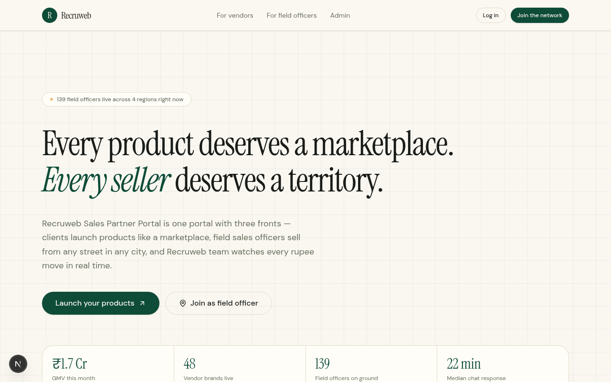
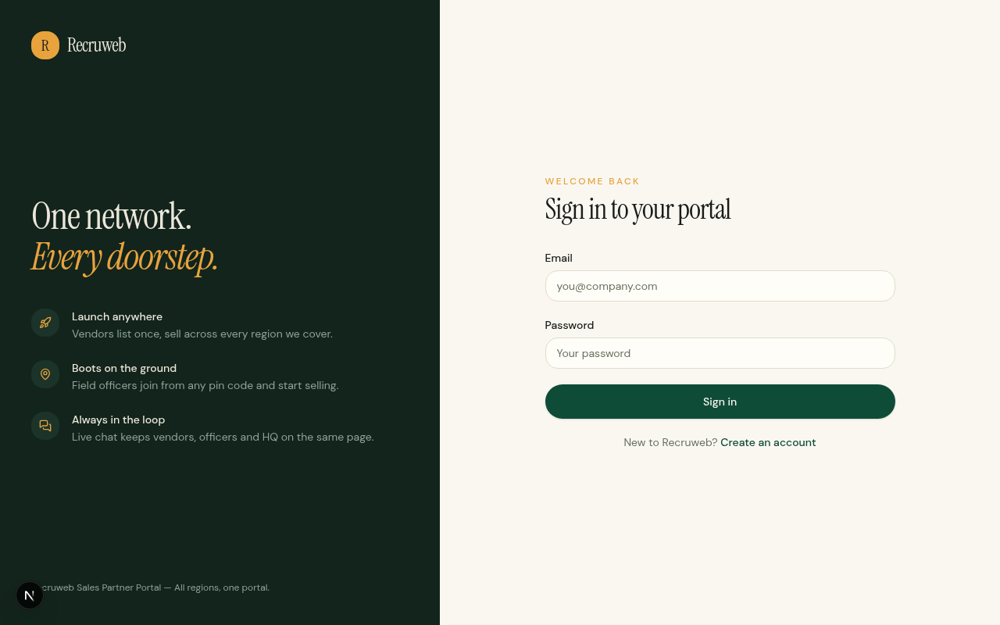
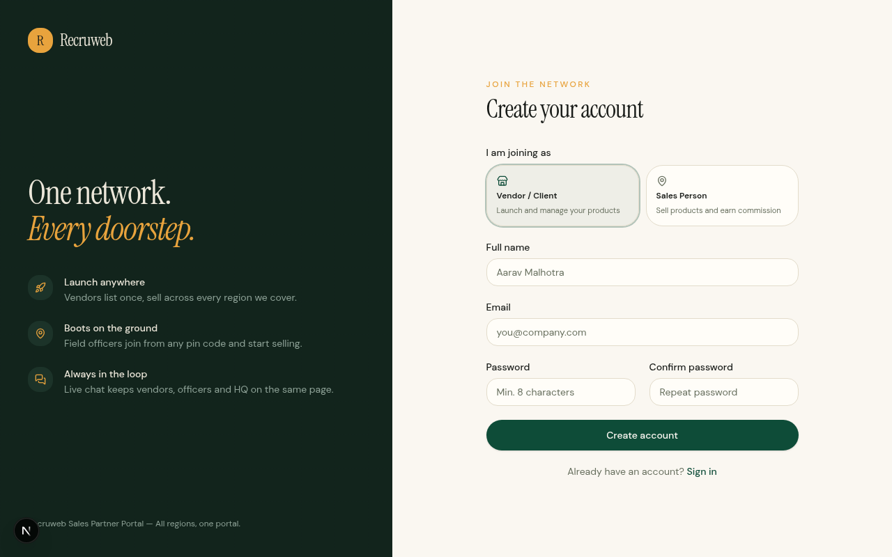
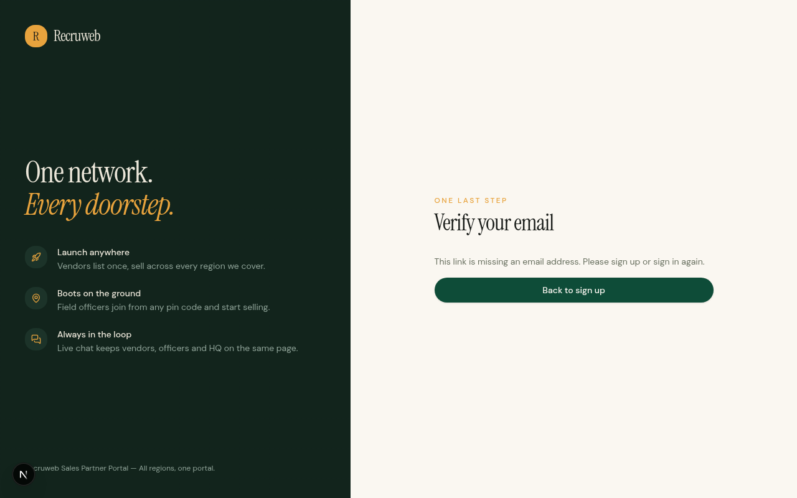
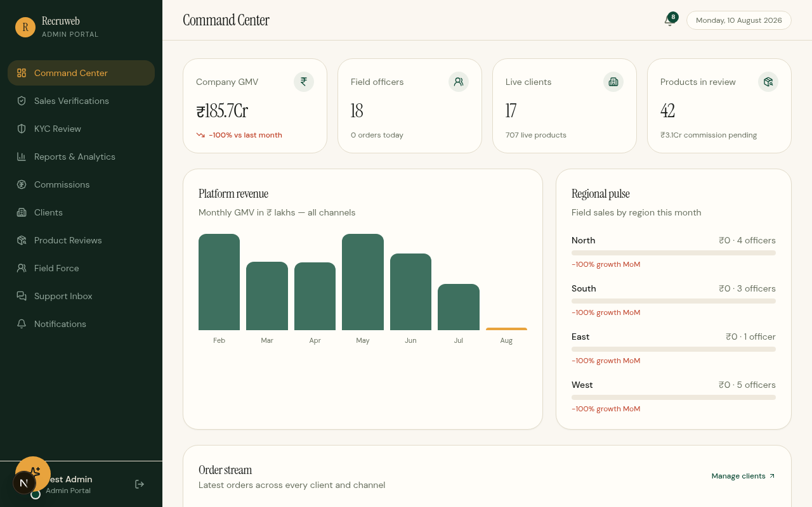
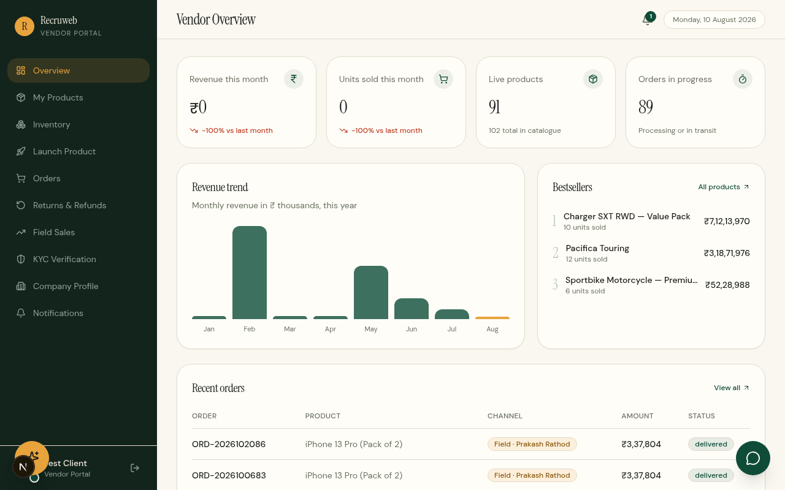
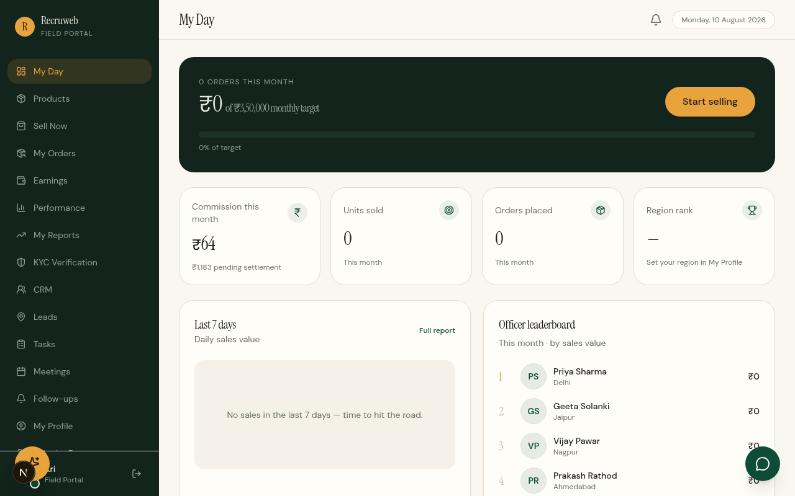

# Recruweb Salesportal

A full-stack, three-tier sales portal: **Admin command center**, **Client portal**, and **Field officer portal** — built with Next.js 16, Express, and MySQL. Includes KYC verification with document uploads, orders, commissions, returns & refunds, real-time chat, notifications, and an optional AI assistant.

| Layer    | Tech                                                              |
| -------- | ----------------------------------------------------------------- |
| Frontend | Next.js 16 (App Router), Tailwind CSS, framer-motion, SWR         |
| Backend  | Express (Node.js), custom JWT auth (bcrypt + HttpOnly cookie)     |
| Database | MySQL 8 (schema + demo data included in this repo)                |
| Files    | KYC documents on disk, served via signed one-time token routes    |

---

## Screenshots

### Landing page



### Authentication

| Login | Sign up | Email verification |
| ----- | ------- | ------------------ |
|  |  |  |

### Admin — Command Center



### Client — Vendor Portal



### Field Officer — My Day



---

## Demo login credentials (three tiers)

| Role              | Email                          | Password        | Portal    |
| ----------------- | ------------------------------ | --------------- | --------- |
| **Admin**         | `test.admin@recruweb-demo.com` | `Recruweb#2026` | `/admin`  |
| **Client**        | `test.client@recruweb-demo.com`| `Recruweb#2026` | `/client` |
| **Field officer** | `test.field@recruweb-demo.com` | `Recruweb#2026` | `/field`  |

> Sign in at `/auth/login` — each account is automatically routed to its own portal.
> Only the exact `ADMIN_EMAIL` account gets the admin portal (super-admin lockdown); every other admin claim is demoted to client.

---

## Quick start (fresh clone → running app)

**Prerequisites:** Node.js 20+, MySQL 8+ running locally.

### 1. Set up the database (the only manual step)

```bash
# Creates the `salesportal` database + app user (salesportal_app / Salesportal@App2026)
mysql -u root -p < backend/db/mysql/00_setup.sql

# Imports the full schema + demo data (24 tables, demo accounts included)
mysql -u root -p salesportal < backend/db/mysql/salesportal_full.sql
```

### 2. Configure environments (copy — defaults already work)

```bash
# Windows (PowerShell)
Copy-Item backend/.env.example backend/.env
Copy-Item frontend/.env.example frontend/.env.local

# macOS / Linux
cp backend/.env.example backend/.env
cp frontend/.env.example frontend/.env.local
```

The example files ship with working local defaults — no editing needed for a local run.
The only rule: `JWT_SECRET` and `ADMIN_EMAIL` must be **identical** in both files (they already are).

### 3. Install & run

```bash
# Terminal 1 — backend (http://localhost:5000)
cd backend
npm install
npm run dev

# Terminal 2 — frontend (http://localhost:3000)
cd frontend
npm install
npm run dev
```

Open **http://localhost:3000** and sign in with any of the demo accounts above.

---

## What's included in the database dump

- All 24 tables (profiles, orders, commissions, KYC, returns, refunds, chat, notifications, …)
- The three demo accounts with working bcrypt password hashes
- Demo orders, leads, commissions, and KYC records so every dashboard renders real data
- Demo KYC documents in `backend/uploads/kyc-docs/` (committed to the repo)

## Optional features (work without configuration, better with it)

| Feature            | Env vars (backend/.env)              | Behavior when unset               |
| ------------------ | ------------------------------------ | --------------------------------- |
| AI assistant       | `GEMINI_API_KEY` (free at aistudio.google.com) | Widget shows "not configured" message |
| Email notifications| `SMTP_HOST`, `SMTP_USER`, `SMTP_PASS`| Silently skipped                  |
| Push notifications | `VAPID_PUBLIC_KEY`, `VAPID_PRIVATE_KEY` (`npx web-push generate-vapid-keys`) | Silently skipped |

## Project structure

```
├── frontend/            # Next.js 16 app (three portals + auth + landing)
│   ├── app/admin/       # Admin command center
│   ├── app/client/      # Client portal (orders, returns, KYC, chat)
│   ├── app/field/       # Field officer portal (leads, commissions)
│   └── middleware.ts    # JWT session verification + role-based routing
├── backend/             # Express API (port 5000)
│   ├── src/routes/      # REST endpoints
│   ├── src/controllers/ # Business logic (per-user ownership scoping)
│   ├── db/mysql/        # 00_setup.sql + salesportal_full.sql (schema + data)
│   └── uploads/         # KYC documents (served via signed token routes)
└── README.md
```

## Production notes

Before deploying publicly:

1. Generate a real `JWT_SECRET` (`openssl rand -base64 48`) and set it in **both** env files.
2. Change the demo account passwords (or delete the demo accounts).
3. Change the MySQL app-user password in `00_setup.sql` and `backend/.env`.
4. Move MySQL to a managed host and `backend/uploads/` to object storage.
